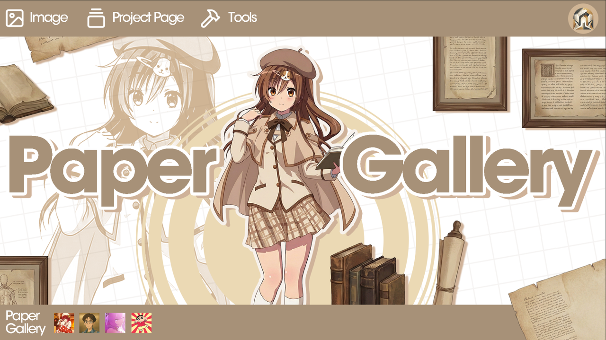
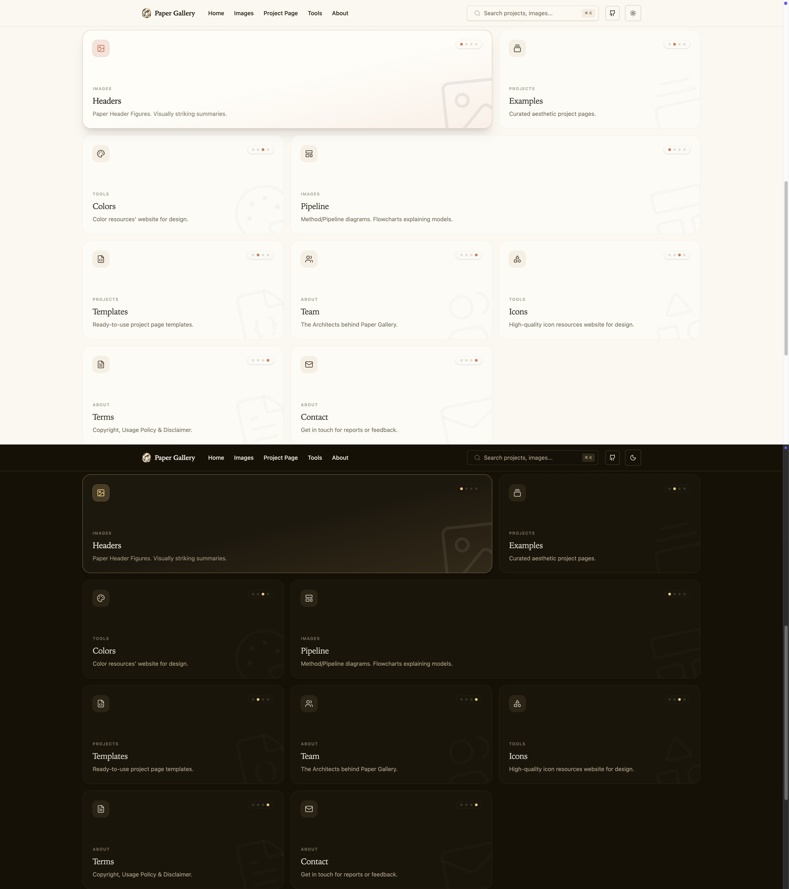
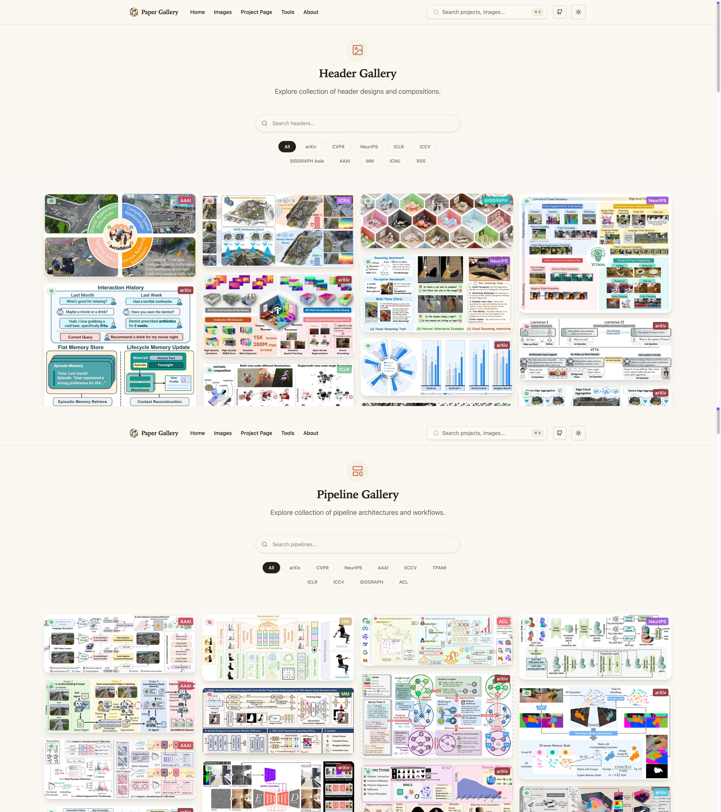
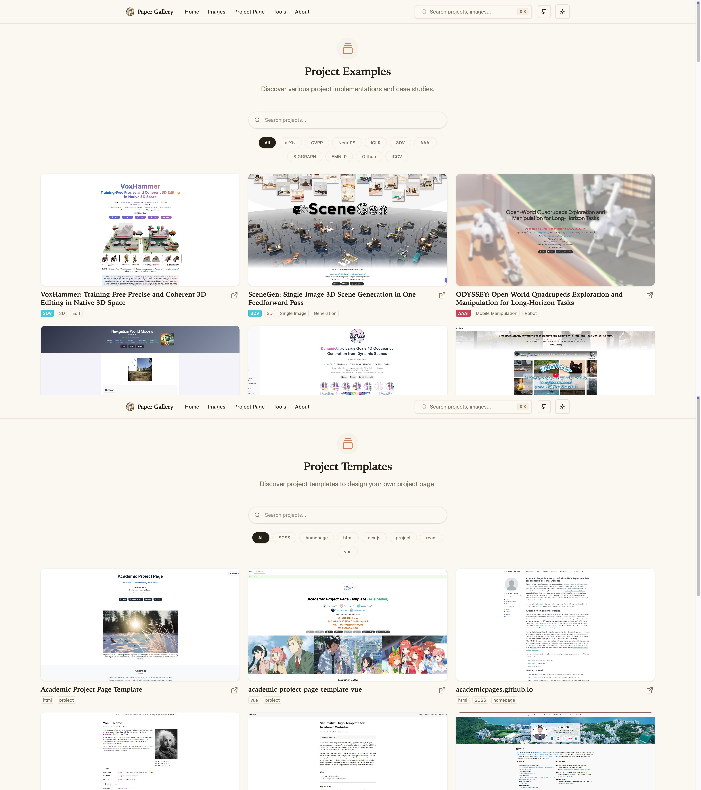
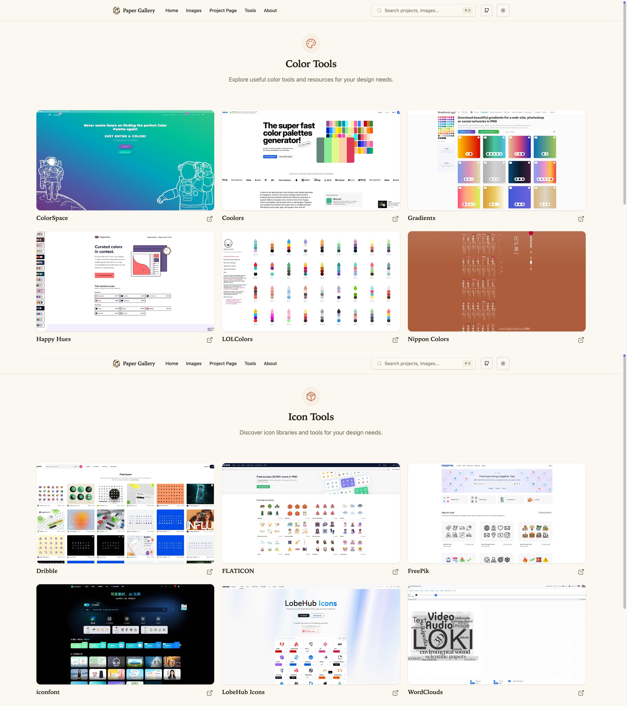

# 🖼️ PaperGallery

  

*"A curated gallery and toolkit designed to provide inspiration for scientific illustrations, project sites, and visual storytelling in research."*

 

## 🌐 Website Content

* Images
  * [Header/Flag](https://longhz140516.github.io/PaperGallery/images/header/)
  * [Pipeline/FlowChart](https://longhz140516.github.io/PaperGallery/images/pipeline/)
* Project Page
  * [Examples](https://longhz140516.github.io/PaperGallery/project/examples/)
  * [Templates](https://longhz140516.github.io/PaperGallery/project/templates/)
* Tools
  * [Color Website](https://longhz140516.github.io/PaperGallery/tools/colors/)
  * [Icon Website](https://longhz140516.github.io/PaperGallery/tools/icons/)

  
  
  
  

## 🧾 Plan

Moving forward, we remain committed to continuously enriching the website with new content and themes, aiming to provide comprehensive support to a wider audience.

## 📎 Resource

Driven by our commitment to open source and the research community, the complete source code and other resources for this website is maintained in the web branch of this repository. **You are free to clone and deploy it locally.** For detailed deployment instructions, please refer to [web branch README.md](https://github.com/LongHZ140516/PaperGallery/tree/web)

## ☎️ Community & Contact

We welcome contributions to our content. If you have any questions, suggestions, or feedback regarding the project, please feel free to contact us.

* E-mail: [Organizational email](papergallery@163.com)
* Member Information: [Information Card](https://longhz140516.github.io/PaperGallery/about/team/)